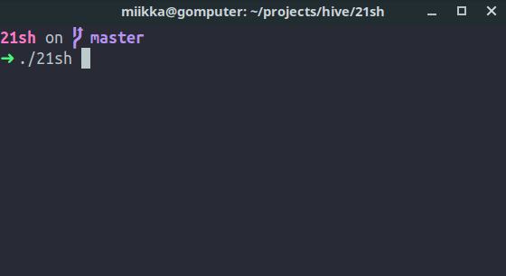
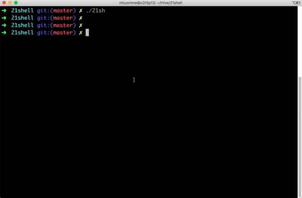

<h1 align="center">
	21shell - Our own shell
	<br><br>
</h1>

<p align="center">
	
</p>

>This was a big, challenging and most time-consuming project that Hive Helsinki currently offers.
>See also [restrictions](#Restrictions) we had. Developing continues on a different repository.

<!--
SCC is tool used
-->

```
───────────────────────────────────────────────────────────────────────────────
Language                 Files     Lines   Blanks  Comments     Code Complexity
───────────────────────────────────────────────────────────────────────────────
C                          155      8124      745      1970     5409       1509
C Header                     8       883      120       151      612          0
Makefile                     2       254       27        11      216          0
Markdown                     2       153       22         0      131          0
Python                       2       315       12         1      302         21
gitignore                    2        15        0         0       15          0
───────────────────────────────────────────────────────────────────────────────
Total                      171      9744      926      2133     6685       1530
───────────────────────────────────────────────────────────────────────────────
Estimated Cost to Develop $198,587
Estimated Schedule Effort 8.300657 months
Estimated People Required 2.833962
───────────────────────────────────────────────────────────────────────────────
```

### Features
- Dynamic Context-Aware Autocompleter
- Multiline support
- History
- Global clipboard with support of OS X and Linux (xclip)

### Try It
Compile and run with:
```bash
make
./21sh
```

### Unittests
```sh
python3 test-suite/tests.py
```

### Keyboard shorcuts
| KEY | ACTION |
|---------|---------|
| <kbd>CTRL + LEFT</kbd> | Moves cursor one word **left** |
| <kbd>CTRL + RIGHT</kbd> | Moves cursor one word **right** |
| <kbd>CTRL + UP</kbd> | Moves cursor one row **up** |
| <kbd>CTRL + DOWN</kbd> | Moves cursor one row **down** |
| <kbd>HOME</kbd> | Moves cursor to **beginning** of input |
| <kbd>END</kbd> | Moves cursor to **end** of input |
| <kbd>DELETE</kbd> | Delete char at cursor position |
| <kbd>CTRL + L</kbd> | Clear screen |
| <kbd>CTRL + U</kbd> | Clear input |
| <kbd>CTRL + D</kbd> | Delete char at cursor, exit if no input |
| <kbd>CTRL + W</kbd> | **Cut** from start to cursor
| <kbd>CTRL + E</kbd> | **Cut** from cursor to end
| <kbd>CTRL + A</kbd> | **Yank**, internal paste
| <kbd>CTRL + K</kbd> | **Copy**. Copy current input to clipboard |
| <kbd>CTRL + P</kbd> | External **Paste** |
| <kbd>LEFT</kbd> | Moves cursor left |
| <kbd>RIGHT</kbd> | Moves cursor right |
| <kbd>UP</kbd> | Get next command from history |
| <kbd>DOWN</kbd> | Go back one command |
| <kbd>BACKSPACE</kbd> | Delete on char left of cursor and move cursor left |
| <kbd>ESC</kbd> | Quit |


### Restrictions
- Max **25 lines** per function
- Max **5 functions** per **.c file**
- Comments are only allowed outside of functions
- All defines, and typedef must be done in header files
- No leaks
- No unexpected quits

#### Allowed functions
```
malloc, free
access
open, close, read, write
opendir, readdir, closedir
getcwd, chdir
stat, lstat, fstat
fork, execve
wait, waitpid, wait3, wait4
signal, kill
exit
pipe
dup, dup2
isatty, ttyname, ttyslot
ioctl
getenv
tcsetattr, tcgetattr
tgetent
tgetflag
tgetnum
tgetstr
tgoto
tputs
```

### Bonus

This is what the shell looked like when development started

<p>
	
</p>

<div align='center'>
    <sub>Created by <a href='https://github.com/rouhija'>Sami Rouhe (srouhe)</a> and <a href='https://github.com/tuommii'>Miikka Tuominen (mtuomine)</a></sub>
</div>
<div align='center'>
    <sub>From <a href='https://www.hive.fi/en/'>Hive Helsinki</a></sub>
</div>
