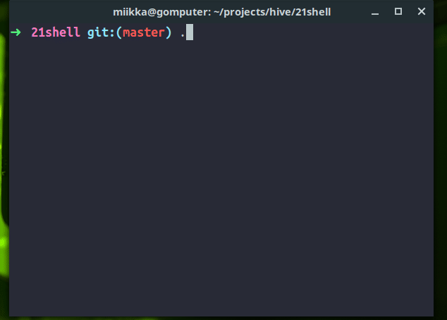

<h1 align="center">
	Shell
	  
</h1>

	

Our own shell.

## GIF(s)
- Should demonstrate editor features
- Should demonstrate parsing features

## Features
- [x] Sami write this part, my features are shown below

## Keyboard shorcuts
| KEY | ACTION |
|---------|---------|
| <kbd>CTRL + LEFT</kbd> | Moves cursor one word **left** |
| <kbd>CTRL + RIGHT</kbd> | Moves cursor one word **right** |
| <kbd>CTRL + UP</kbd> | Moves cursor one row **up** |
| <kbd>CTRL + DOWN</kbd> | Moves cursor one row **down** |
| <kbd>HOME</kbd> | Moves cursor to **beginning** of input |
| <kbd>END</kbd> | Moves cursor to **end** of input |
| <kbd>DELETE</kbd> | Delete char at cursor position |
| <kbd>CTRL + L</kbd> | Clear screen |
| <kbd>CTRL + D</kbd> | Delete char at cursor, exit if no input |
| <kbd>CTRL + X</kbd> | **Cut**. First press is start index and second is end index |
| <kbd>CTRL + K</kbd> | **Copy**. Copy current input to clipboard |
| <kbd>CTRL + P</kbd> | **Paste** |
| <kbd>LEFT</kbd> | Moves cursor left |
| <kbd>RIGHT</kbd> | Moves cursor right |
| <kbd>UP</kbd> | Get next command from history |
| <kbd>DOWN</kbd> | Go back one command |
| <kbd>BACKSPACE</kbd> | Delete on char left of cursor and move cursor left |
| <kbd>ESC</kbd> | Quit |

    Created by <a href='https://github.com/rouhija'>Sami Rouhe (srouhe) <a href='https://github.com/tuommii'>Miikka Tuominen (mtuomine)</a>

    From <a href='https://www.hive.fi/en/'>Hive Helsinki</a>

